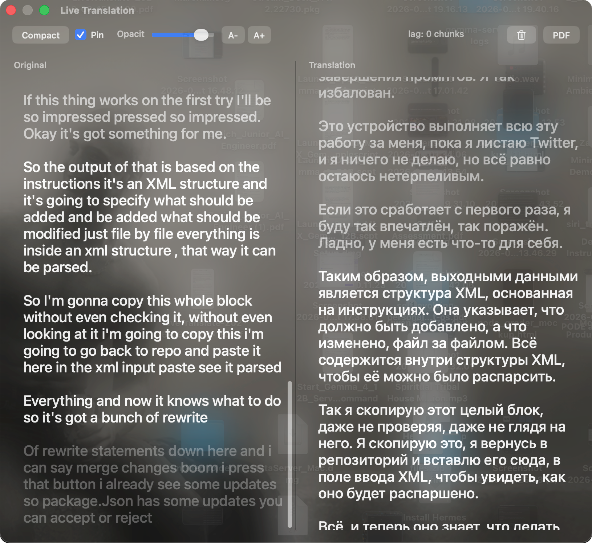

# Live Translation

A little macOS app that listens to **any sound your Mac is playing — from any app** — transcribes it, translates it, and paints both the original and the translation onto a floating glass overlay, live, as people talk.

<p align="center">
  
</p>

That's the whole idea: it doesn't care *where* the audio comes from. A YouTube video in your browser, a Zoom call, VLC, a podcast, a Twitch stream, a foreign news livestream, a game — if your Mac can play it through its speakers, this can transcribe it and translate it into a language you actually read. Real-time transcription + translation for the entire machine, running **entirely on your machine**. Nothing gets uploaded anywhere.

I built it for the moments when audio is useful but the language is in the way: foreign news, talks, calls, streams, videos, podcasts, or anything else your Mac can play. It shows both what was said and what it means in your language. It grew a bunch of knobs from there.

It's a hack. It works surprisingly well. Read on.

## TLDR

```
system audio ──► whisper (speech→text) ──► local LLM (translate) ──► glass overlay
   (BlackHole)        (mlx, large-v3)         (mlx, Qwen3.5-9B)         (pyobjc)
```

Everything is local: [MLX](https://github.com/ml-explore/mlx) Whisper for transcription, a local LLM (MLX Qwen by default) for translation, Silero VAD to throw away silence. The UI is a translucent always-on-top window drawn with pyobjc.

## Who's this for

Honestly I built it for me, but if any of these is you, it'll probably help:

- You watch **foreign-language media** — news, YouTube, documentaries, films, Twitch — and want live transcription and translation instead of waiting for subtitles.
- You're **learning a language** and want to see the original *and* a translation side by side, live, on real native speech instead of textbook audio.
- You sit in **calls / meetings / webinars** in a language you only half-speak.
- You want **captions and translation for accessibility** on audio that has none.
- You just want to know **what that video is actually saying** without copy-pasting anything anywhere.

And a hard requirement for some people: it's **fully offline and private**. The audio never leaves your Mac. No API key, no account, no cloud. That matters if you're translating a confidential call or you just don't want your media diet logged somewhere.

## How it's different from the other repos

There are a lot of "whisper + something" projects on GitHub. I looked. Most fall into one of these, and this one sits in the gap between them:

- **Cloud captioners / translators** (anything calling the OpenAI/Deepgram/Google APIs) — fast and accurate, but your audio leaves the machine and you pay per minute. This is 100% local.
- **Transcription-only tools** (MacWhisper, Buzz, whisper.cpp GUIs) — great at speech→text, but they don't translate, and many want a *file*, not live system audio.
- **OBS / streamer plugins** (LocalVocal) — live and local, but built for broadcasting to *your* viewers, configured inside OBS, not a thing you pop open to read a video yourself.
- **Meeting bots** — join a specific Zoom/Meet call via an account/bot; they don't caption arbitrary system audio from any app.
- **Word-by-word MT** — translate token streams with a small MT model; cheaper, but you get choppy word-salad instead of sentences.

What this combines, which I didn't find in one place: **any app's audio** (system-wide, not file/URL/one-call) + **a real LLM doing sentence-level translation** (not word-by-word MT) + **a floating glass overlay** you read on top of anything + **fully local** + a deliberate **don't-lose-words** design. It's not the fastest or the prettiest; it's the one that translates the *whole machine*, locally, into readable sentences.

(It's also a single Python file you can actually read end to end, if that's your thing.)

## Quickstart

You need a Mac with Apple silicon. The fast path:

```bash
./setup.sh        # python deps + BlackHole + (optional) ollama + downloads the models
```

That does everything below. If you'd rather understand the pieces, here they are.

### 1. Install the Python + system deps

```bash
python3 -m venv .venv && ./.venv/bin/pip install -r requirements.txt
brew bundle --file=Brewfile      # installs BlackHole + ffmpeg + ollama
```

### 2. Capturing system audio — why you need BlackHole

macOS, on purpose, won't let an app just grab "whatever is coming out of the speakers." A microphone, sure. The system output, no. So to feed your Mac's audio into this app we need a **virtual audio device** that loopbacks output → input. That's [**BlackHole**](https://github.com/ExistentialAudio/BlackHole) — a free, open-source virtual audio driver. The `2ch` variant is what we use.

The catch: if you send audio *into* BlackHole, it stops coming out of your speakers, so you'd go deaf. The fix is a **Multi-Output Device** that sends audio to your speakers/headphones *and* BlackHole at the same time:

1. Open **Audio MIDI Setup** (in /Applications/Utilities)
2. Click **+** → **Create Multi-Output Device**
3. Tick both your normal output (e.g. *MacBook Speakers*) **and** *BlackHole 2ch*
4. Set that Multi-Output Device as your system output (System Settings → Sound → Output)

Now you hear everything normally, and the app hears it too. (If you don't care about hearing it yourself, you can skip the Multi-Output and just set output straight to BlackHole.)

### 3. The models

Three models get downloaded the first time (or up front by `setup.sh`):

- **Whisper large-v3** (transcription) and **Qwen3.5-9B** (translation) — both MLX, pulled automatically from Hugging Face on first run. No API keys, no accounts.
- **Silero VAD** ships inside the `silero-vad` pip package — nothing to download.

To grab them ahead of time instead of on first launch:

```bash
./.venv/bin/python -c "from huggingface_hub import snapshot_download; \
[snapshot_download(r) for r in ('mlx-community/whisper-large-v3-mlx','mlx-community/Qwen3.5-9B-MLX-4bit')]"
```

(Optional) if you want the translategemma backend instead of Qwen: `ollama pull translategemma:12b`.

### 4. Run

Two ways — pick whichever you like, they open the exact same overlay.

**a) Double-click `LiveTranslate.app`** — the no-terminal way. Just launch it from Finder (see step 5 to move it to /Applications).

**b) From the terminal** — if you'd rather not use the app at all:

```bash
./.venv/bin/python live_translate_overlay.py --target ru
```

(Call the venv's python directly — don't run `./live_translate_overlay.py`, its shebang is hard-coded.) This is also where you tweak anything: pass `--source es`, `--whisper medium`, etc. to make it behave *identically to the app's launcher*, add the flags the bundle uses by default:

```bash
./.venv/bin/python live_translate_overlay.py \
    --legacy-chunking --mlx-llm mlx-community/Qwen3.5-9B-MLX-4bit --target ru
```

See [knobs](#knobs) below or `--help` for the full list.

Either way: pick source/target languages in the overlay's top bar, play a video in any app, text shows up.

### 5. (Optional) put the app in /Applications

`LiveTranslate.app` lives inside the project folder and works two ways:

- **portable** (default) — keep the `.app` where it is and just double-click it. The launcher finds the project relative to itself, so you can copy the *whole folder* anywhere, on any Mac, and it still works. Nothing to configure.
- **installed** — if you'd rather have the app on its own in `/Applications` (Launchpad, Spotlight, Dock), run:

  ```bash
  ./install-app.sh            # copies to /Applications, or: ./install-app.sh ~/Apps
  ```

  This records the project's location (so the detached app can still find your venv + models) and re-signs the copy. If you later move the project, just run `./install-app.sh` again from its new spot.

**First launch on your Mac:** the app is ad-hoc signed (no Apple Developer ID), so Gatekeeper may refuse the first double-click with *"can't be opened because it is from an unidentified developer."* This is expected for a local build. Just **right-click the app → Open** once and confirm — macOS remembers the choice and double-click works normally afterward. (Or: System Settings → Privacy & Security → *Open Anyway*.) You'll also get a one-time microphone prompt — that's BlackHole's loopback audio, allow it.

## The bar at the top

The window is two columns — original on the left, translation on the right — and a thin toolbar. Nothing needs explaining, but since you asked:

- **Source / Target** — the language you're listening to and the one you want it in. Leave Source on *Auto* and Whisper figures it out per sentence (pin it if the audio mixes languages and the detector wobbles).
- **Compact** — hide the original, show only the translation (one wide column) when you just want the gist.
- **Pin** — keep the window floating above everything (on by default). Turn off if you want it to behave like a normal window.
- **Opacity** slider + **A- / A+** — how see-through the glass is, and the font size. Read it over a bright video or shrink it out of the way.
- **lag: N** — how many audio chunks are waiting. Zero-ish = keeping up live; if it climbs and stays up, your machine isn't keeping pace (try `--whisper medium`).
- 🗑 **(trash)** — wipe everything and start clean: both columns, the history, and all the model state behind them.
- **PDF** — dump the whole session (every original + translation pair, not just what's on screen) to a PDF.

The window itself is draggable (grab anywhere) and resizable from the edges; controls on the right tuck away if you make it narrow.

## How it works (the parts I think are interesting)

The naive version of this — chop audio into fixed 5s chunks, transcribe each one independently — is bad. Whisper sticks a period at the end of every chunk, cuts words in half at boundaries, and repeats itself. Most of the interesting work is in *not* doing that.

- **Segmentation that doesn't lose anything (the default).** Audio is cut into chunks *at natural pauses* (found with VAD), not at fixed sizes, so words don't get sliced in half. Each chunk is transcribed exactly once, with overlap between chunks; an overlap-dedup merges the seams, a sentence assembler regroups text on real punctuation, and a spurious-period stripper removes the period Whisper adds at a chunk end when the speaker only paused for breath. The hard rule here is **no dropped audio**: the queues block instead of dropping, so if transcription falls behind for a moment it catches up rather than throwing speech away. For live news I'd rather be a second late than miss a word.

- **A smoother (but lossy) streaming mode, off by default.** There's also a LocalAgreement-2 mode (`whisper-streaming` / WhisperLiveKit style): keep a rolling buffer, re-transcribe it every ~1.5s, and only *commit* a word once two consecutive passes agree on it, showing the unconfirmed tail as a dim live draft. It reads beautifully — text flows and self-corrects instead of appearing in blocks. But re-transcribing the same audio repeatedly is expensive, and to keep up with large-v3 it has to either drop audio or trim its buffer — i.e. **lose pieces**. Since I can't afford that, it's behind a flag; the default is the lossless chunker above. (It's the right call if you pair it with a faster model.)

- **Surviving Whisper's punctuation drift.** On fast, pause-less speech Whisper sometimes stops emitting punctuation for a stretch — and because the recently finalized text is fed back as its `initial_prompt`, a punctuation-less run *reinforces itself* and the overlay collapses into one giant paragraph, then snaps back later. Two guards: (1) the prompt feedback is dropped whenever that recent context has no sentence punctuation, so the next chunk can re-introduce sentence boundaries instead of inheriting the drift; (2) when a block still arrives with no punctuation at all, it's split into readable paragraphs at clause boundaries (commas/dashes) or, failing that, at word boundaries near a target length — never one wall, never mid-word.

- **VAD before Whisper.** Whisper *will* invent speech out of silence and music — it was trained on YouTube subtitles, so on non-speech it confidently emits "thanks for watching" and friends. So we run [Silero VAD](https://github.com/snakers4/silero-vad) first and simply don't send chunks without enough real speech. This killed most of the hallucinations and also fixed a nasty stall where long pauses (switching videos) would choke the pipeline.

- **A hallucination blocklist** for the ones that sneak through anyway ("gracias", "subtitles by amara.org", etc.), stripped before translation.

- **Translation by a real LLM, not word-by-word MT.** The LLM gets whole sentences and the recently-translated context, so it produces coherent sentences instead of word salad. Translation runs in the same worker thread that loaded the model — sounds obvious, but MLX uses a thread-local GPU stream, so loading on one thread and generating on another silently explodes on long prompts. Lazy-load on first use fixed it.

- The overlay is just an `NSTextView` in a translucent floating window. Resizable, pinnable, opacity slider, font size, save-to-PDF, clear button. Nothing fancy.

## The models

**Transcription: Whisper large-v3, on MLX.** Two separate choices here. `large-v3` because it's the most accurate Whisper size — for live foreign-language audio with names, places and accents you want every bit of accuracy you can get, and the cheaper models start dropping words. And **[MLX](https://github.com/ml-explore/mlx) because it's the fastest way to run Whisper on a Mac** — it's Apple's own array framework, runs on the GPU through Metal with unified memory (no copying audio tensors back and forth), and on Apple silicon it beats the CPU-bound options (faster-whisper, whisper.cpp) for this workload. That combination — heaviest model at usable speed — is the *only* reason real-time large-v3 is even feasible on a laptop. On a smaller Mac you can still drop to `--whisper medium` for more headroom.

**Translation** defaults to **Qwen3.5-9B** (4-bit MLX, on-device). I also wired up **translategemma:12b** (a translation-tuned Gemma, via ollama) and did a little bake-off on real news clips:

- **translategemma**: more fluent, better with idioms and world knowledge ("los Mossos" → "catalan police"). But sometimes *adds* stuff that wasn't said, and ~1.5x slower.
- **Qwen3.5-9B**: faster, more literal/faithful, occasionally clumsy word choice.

For live news I kept Qwen — accuracy + latency win over polish. But it's one line in the launcher to switch (`--translator ollama --ollama-model translategemma:12b`). Your mileage will vary by language pair; try both with your ears.

## Knobs

It's a CLI under the hood, so everything is tunable. Some you'll actually touch:

```
--legacy-chunking          the lossless chunk pipeline (DEFAULT in the .app launcher)
--source / --target        languages (or pick in the UI). source=auto detects per-utterance
--whisper large-v3         transcription model (small/medium are faster, worse)
--mlx-llm REPO             translation model (any MLX-LM repo)
--translator ollama        use ollama instead of MLX (e.g. for translategemma)
--silence-rms 0.006        louder = stricter silence gate
--vad-min-speech-ms 250    min real speech per window before whisper sees it
# streaming mode (omit --legacy-chunking): smoother, but lossy under load
--update-seconds 1.5       how often to re-transcribe the rolling buffer (lower = snappier, heavier)
```

`./.venv/bin/python live_translate_overlay.py --help` for the full list (there are ~30; most you'll never need).

## Robustness / things that took embarrassingly long

The "interesting" 20% above is the fun part. The other 80% was making it not fall over, which is never in the demo but is the whole difference between a toy and something you leave running for an hour. A sampler:

- **The audio thread silently dying.** Switch YouTube videos, CoreAudio re-inits the route, the input callback goes quiet forever, and transcription just... stops, with no error. Now there's a watchdog that notices the silence and reopens the stream.
- **The live-vs-complete tradeoff.** My first instinct when Whisper fell behind was to drop the oldest audio and stay *live* — great for a clock, terrible when you actually care about every word. So the default flipped the other way: the queues block, nothing gets dropped, and if it falls behind it just runs a second or two late and catches up. "don't lose pieces" won over "always be live."
- **The Clear button only clearing the screen.** Turns out "clear" needs to wipe the rolling audio buffer, both worker threads' state, the pending queues, *and* discard the chunk that's mid-flight inside Whisper at that exact moment. Otherwise old text keeps dribbling in after you hit clear. All of that now resets from one generation counter.
- **Workers dying on a single bad frame.** One unguarded exception in the audio loop and the whole pipeline goes dark with nothing in the log. Everything is wrapped now and logs `[chunk]`/`[audio]`/`[stream]`/`[ui]` so the next stall names itself.
- **Shipping it as a double-clickable app.** This ate an afternoon. macOS LaunchServices will *not* run a `.app` whose executable is a shell script — it just silently does nothing. So the bundle's executable is a tiny compiled C launcher that execs the real script, the whole thing is ad-hoc codesigned (`codesign -s -`), and only then does double-click work. Also it kept vanishing from the Dock until I set the activation policy to `Regular`.

None of this is clever. All of it was necessary.

## Honest caveats

- macOS + Apple silicon only. The overlay is pyobjc/Cocoa, the inference is MLX.
- You have to route audio through BlackHole yourself. macOS makes capturing system audio annoying on purpose.
- large-v3 is not free. The default lossless chunker keeps up on an M-series Mac; if it ever can't, it stays correct but the subtitles drift a second or two behind (it won't drop words). On a smaller Mac use `--whisper medium`. The streaming mode is heavier still.
- Auto language detection wobbles on mixed-language audio (Spanish news with Catalan inserts will flip-flop). Pin `--source` if you know it.
- It still hallucinates sometimes. It's Whisper. We mitigate, we don't cure.
- The code is one big file. It's a personal tool, not a framework. Sorry/not sorry.

## Layout

```
live_translate_overlay.py   the whole thing (capture, VAD, ASR, translate, overlay)
LiveTranslate.app           double-clickable bundle (just launches the script via your venv)
install-app.sh              put the .app in /Applications, detached from the project folder
setup.sh / Brewfile         install everything
requirements*.txt           python deps
```

## License / spirit

[MIT](LICENSE) — personal hack, take it and do whatever. PRs welcome but I make no promises about keeping this tidy.

## Thanks

Thanks to [Alex Ziskind](https://github.com/alexziskind1) for the [benchmark video on the fastest high-quality way to transcribe on a Mac](https://www.youtube.com/watch?v=PxUSE2KwyUQ) (available to channel subscribers). I used the result of that test to choose the MLX Whisper path, which made this pipeline practical.
